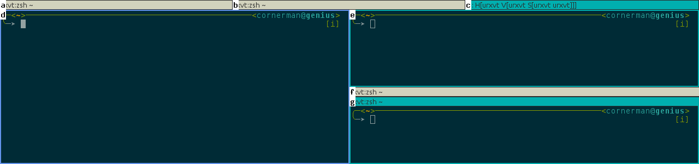

# i3-easyfocus

Focus and select windows in [i3](https://github.com/i3/i3).

Draws a small label ('a'-'z') on top of each visible container, which can be selected by pressing the corresponding key on the keyboard (cancel with ESC). By default, only windows on the current workspace are labelled.

## Usage

Focus the selected window:

```shell
./i3-easyfocus
```

It also possible to only print out the con_id of the selected window and, for example, move it to workspace 3:

```shell
./i3-easyfocus -i | xargs -I {} i3-msg [con_id={}] move workspace 3
```

Or to print the window id and use it with other commands, like xkill:
```shell
./i3-easyfocus -w | xargs xkill -id
```

## Configuration

```
Usage: i3-easyfocus <options>
 -h --help              show this message
 -i --con-id            print con id, does not change focus
 -w --window-id         print window id, does not change focus
 -a --all               label visible windows on all outputs
 -c --current           label visible windows within current container
 -r --rapid             rapid mode, keep on running until Escape is pressed
 -m --modifier <mod>    listen to keycombo <mod>+<label> instead of only <label>
                            - ctrl, shift, mod1, mod2, mod3, mod4, mod5
                            - or combine with, e.g., mod1+shift
 -s --sort-by <method>  how to sort the workspaces' labels when using --all:
                            - <location> based on their location (default)
                            - <num> using the workspaces' numbers
 -f --font <font-name>  set font name, see `xlsfonts` for available fonts
 -k --keys <mode>       set the labeling keys to use:
                            - <avy> prefers home row for qwerty (default)
                            - <colemak> prefers home row for colemak
                            - <alpha> orders alphabetically
 --color-urgent-bg <rgb>    set label background color of urgent windows, e.g., FF00FF
 --color-focused-bg <rgb>   set label background color of focused windows, e.g., FF00FF
 --color-unfocused-bg <rgb> set label background color of unfocused windows, e.g., FF00FF
 --color-urgent-fg <rgb>    set label foreground color of urgent windows, e.g., FF00FF
 --color-focused-fg <rgb>   set label foreground color of focused windows, e.g., FF00FF
 --color-unfocused-fg <rgb> set label foreground color of unfocused windows, e.g., FF00FF
```

You can change the keybindings and the font in ```src/config.h```.

## Screenshot



## Dependencies

* [i3ipc-glib](https://github.com/acrisci/i3ipc-glib) (>= 0.6.0)
* xcb and xcb-keysyms

## Problems/Debugging

If there is a problem or you have an idea, please feel free to open a new issue.

In order to get more details about a problem you can build in debug mode, which will produce more log messages:
```
make clean debug
./i3-easyfocus
```
